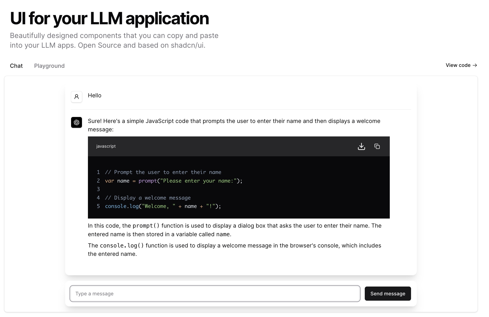

# marcusschiesser/ui

Accessible and customizable components that you can copy and paste into your LLM application. Free. Open Source.

## Documentation

Visit https://ui-www-nine.vercel.app/docs to view the documentation.

## Contributing

Please read the [contributing guide](/CONTRIBUTING.md).

## License

Licensed under the [MIT license](./LICENSE.md).
